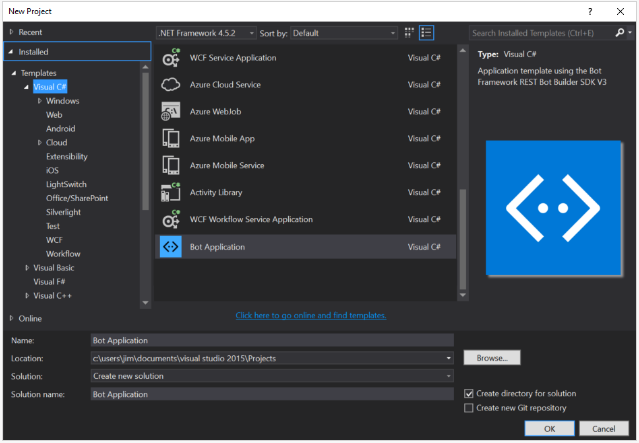

#  FridgeChatBot
### Microsoft Bot Framework (C# .NET) with LUIS.ai integration.

ChatBot that helps you make decisions on what to cook for your next meal. The bot takes ingredients that you have at home, or would like to cook with and offers recipes with ratings, links and pictures. Once you decide on a recipe, it can send you a grocery list so you know exactly what to buy! This bot can even retain the state of your grocery list.


## Walk Through with Resources
FridgeChatBot was created to show what is possible with the Microsoft Bot Framework using C# .NET and the steps it takes to get it created and up and running! We walk through the basics steps of setup and customization using Language Understanding Intelligent Service (LUIS). This walkthrough will cover creating a basic C# chatbot, as well as recreating the FridgeChatBot using the same API.

### Prerequisite: What I will be using throughout this walkthrough
* [Visual Studio (Community Edition)](https://www.visualstudio.com/vs/) - Great IDE for our project code
* [Microsoft account](http://accounts.microsoft.com) - Access LUIS.ai and Bot Framework Account
* [Microsoft Azure Subscription](http://azure.com) – A free trial is sufficient
* [Microsoft Bot Framework Channel Emulator](https://docs.botframework.com/en-us/tools/bot-framework-emulator/#navtitle) - Test our Bot
* [Microsoft Bot Builder SDK](http://aka.ms/bf-bc-vstemplate) - Unzip file. Will be used when starting our VS Project
* Internet connection!

### 1.Creating Your Visual Studio Project
* [Getting started with the Connector](https://docs.botframework.com/en-us/csharp/builder/sdkreference/gettingstarted.html) - Step by step on how to create a new VS project, publish, and register your bot.

1. [Download and install the Bot Application template](http://aka.ms/bf-bc-vstemplate) (Listed in Prereqs)
2. Save the zip file to your Visual Studio 2015 templates directory which is traditionally in "%USERPROFILE%\Documents\Visual Studio 2015\Templates\ProjectTemplates\Visual C#\"
3. Open Visual Studio
4. Create a new C# project using the new Bot Application template.



This template project is an Echo Bot, it will return your input with the number of characters. Let's use the Bot Framework Emulator and check it out!

### 2.Testing with the Bot Framework Emulator


### 3.
### 4.
### 5.


 ```
  > CODE
 ````
