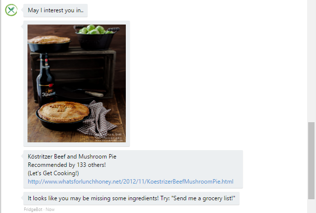
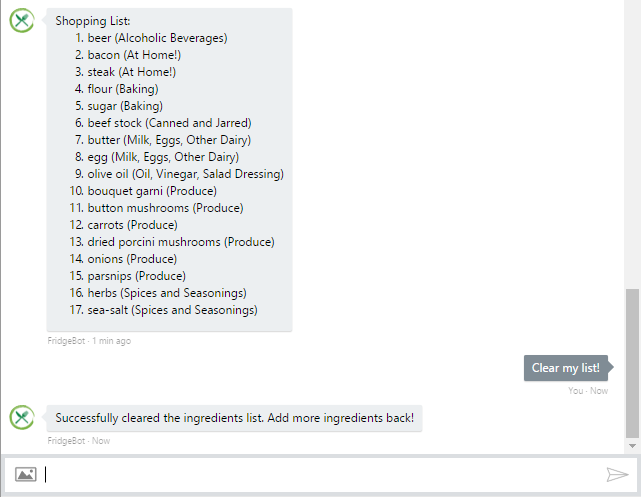

#  FridgeChatBot

### Microsoft Bot Framework (C# .NET) with LUIS.ai integration

ChatBot that helps you make decisions on what to cook for your next meal. The bot takes ingredients that you have at home, or would like to cook with and offers recipes with ratings, links and pictures. Once you decide on a recipe, it can send you a grocery list so you know exactly what to buy! This bot can even retain the state of your grocery list.

Feel free to download this repo and try it on your local machine. All you have to do is provide your own keys in the Web.Config!

## FridgeChatBot Code Breakdown

### Hide your secrets with Web.Config
Ensure that you store any valuable keys in your Web.Config file. These keys should not be leaked to the public, as others can use your keys and consume all of your credits! However, your keys are needed throughout your code in other files, so how do you access them and still keep them safe?

Within your Web.config you can add key value pairs. Now all of your super secret keys are all neat in one file! Just make sure to hide this file! (especially if you are using GitHub, see note below)
```
<configuration>
  <appSettings>
    <!-- update these with your BotId, Microsoft App Id and your Microsoft App Password-->
    <add key="BotId" value="FridgeBot" />
    <add key="Mashape_Key_Kevin" value="<Key HERE>" />
    <add key="MicrosoftAppId" value="<Key HERE>" />
    <add key="MicrosoftAppPassword" value="<Key HERE>" />
    <add key ="MicrosoftLUISId" value = "<Key HERE>" />
    <add key="MicrosoftLUISKey" value="<Key HERE>" />
  </appSettings>
  
  <!-- Other Code -->
  
</configuration>
```

Within your source code, all you need to do to access these keys is:
```
using System.Web.Configuration;

string LUISId = WebConfigurationManager.AppSettings["MicrosoftLUISId"]
```
This will return the string value of the specified key. 

**Note: If you are using a Github repository, make sure to include a .gitignore containing your Web.Config file so no one can find your keys!**

Q: What is a .gitignore?

A: .gitignore is a special file with a list of project files and directories that you are EXPLICITLY telling GitHub to not include in your repository. This allows you to keep certain files/directories private and not public). Check out my .gitignore file for an example.


## DEMO Time!
http://fridgechatbot.azurewebsites.net/

Check out the live bot yourself! Below is an example conversation you can have with FridgeChatBot to help you keep track of ingredients and find a recipe. If you get a pizza number... we ran out of API calls. Try again tomorrow if that happens!




